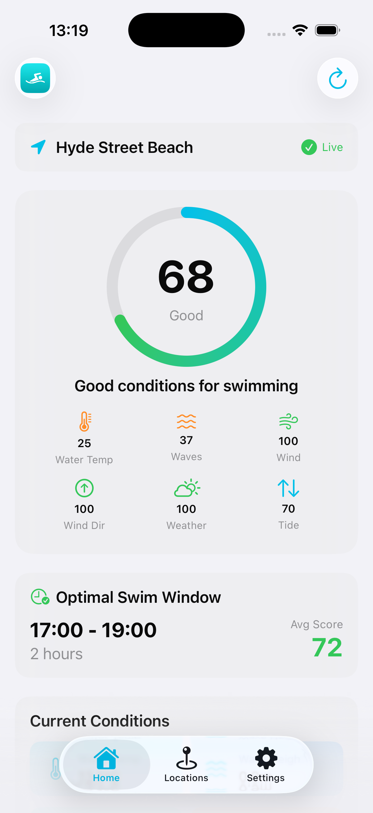
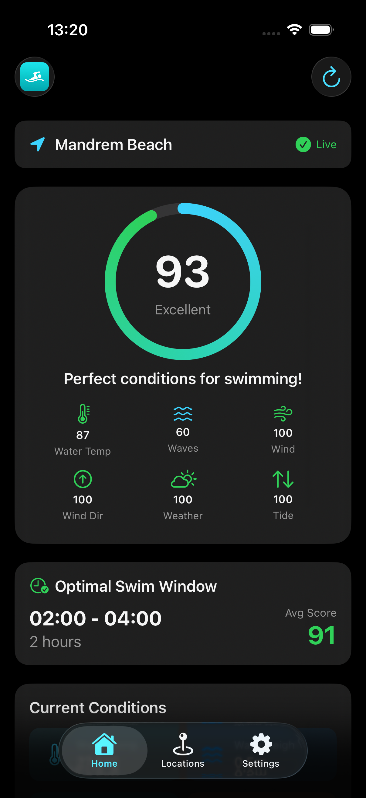
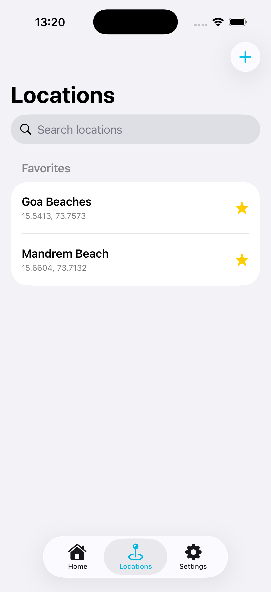
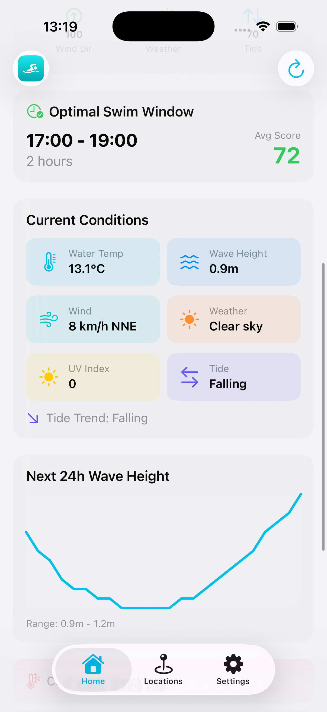
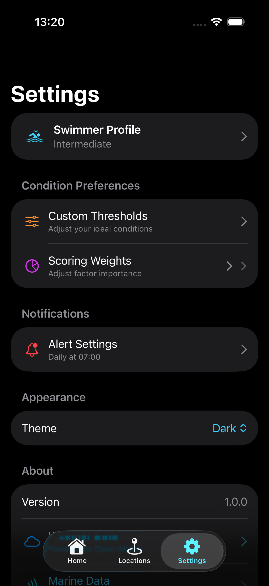

# OptiSwim

OptiSwim is an iOS and Android app that scores open-water swim conditions using marine and weather data, tailored to a swimmer's experience level and preferences. It helps you decide when and where conditions are safest and most comfortable.

## Features
- Current conditions and a multi-day hourly forecast
- Personalized scoring with adjustable thresholds and factor weights
- Safety warnings for hazardous conditions
- Favorite locations with notes and quick access
- Local notifications for daily checks and optimal windows
- On-device caching to reduce repeat network calls

## Screenshots
| Home (Light) | Home (Dark) | Locations |
| --- | --- | --- |
|  |  |  |

| Conditions & Forecast | Settings (Dark) |
| --- | --- |
|  |  |

## How It Works
OptiSwim combines marine (waves, swell) and weather (wind, temperature, UV, weather code) data into a single score. Profiles control thresholds and weights by experience level, and safety warnings override scores when conditions are risky.

## Data Sources
- Open-Meteo Marine (waves, sea level, sea surface temperature)
- Open-Meteo Weather (wind, air temperature, UV, precipitation, weather code)

## Requirements
- Xcode (latest recommended)
- iOS deployment target is set to 26.0 in the project settings

## Getting Started
1. Open `OptiSwim.xcodeproj` in Xcode.
2. Set your signing team.
3. Choose a simulator or device.
4. Build and run.

## Android
The Android app lives under `android/` and uses Kotlin + Jetpack Compose.

## Permissions
OptiSwim requests:
- Location access (when in use and optionally always) to show nearby conditions
- Notification access for daily and safety alerts

## Project Structure
- `OptiSwim/Views` - SwiftUI screens
- `OptiSwim/ViewModels` - view models and state
- `OptiSwim/Services` - API, caching, location, notifications
- `OptiSwim/Models` - data models and scoring logic
- `android/` - Android app

## Safety Note
Conditions and scores are informational only. Always use your own judgment and follow local safety guidance.
